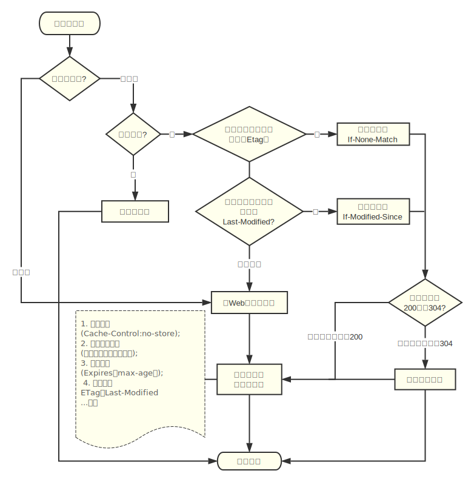

- 缓存
#### 缓存是用来缓解服务器端压力、提升性能、减少带宽消耗，请求资源的副本存储下来的技术。
- 缓存截止到下一次发生改变
- 私有缓存 共享缓存
<pre>Cache-Control: private Cache-Control: public</pre>
- 强缓存 协商缓存（命中缓存就从客户端缓存中获取，区别：强缓存不发送请求，协商缓存发送请求。）
  ##### 强缓存是利用Expires或者Cache-Control这两个http response header实现的，它们都用来表示资源在客户端缓存的有效期。
  ##### Expires原理
  - 浏览器在接收到这个资源后，会把这个资源连同所有response header一起缓存下来（所以缓存命中的请求返回的header并不是来自服务器，而是来自之前缓存的header）
  - 浏览器再请求这个资源时，先从缓存中寻找，找到这个资源后，拿出它的Expires跟当前的请求时间比较，如果请求时间在Expires指定的时间之前，就能命中缓存，否则就不行
  - 如果缓存没有命中，浏览器直接从服务器加载资源时，Expires Header在重新加载的时候会被更新
  ##### cache-control原理 优先级高
  Cache-Control描述的是一个相对时间，在进行缓存命中的时候，都是利用客户端时间进行判断，所以相比较Expires，Cache-Control的缓存管理更有效，安全一些。
  - 浏览器第一次跟服务器请求一个资源，服务器在返回这个资源的同时，在respone的header加上Cache-Control的header
  - 浏览器在接收到这个资源后，会把这个资源连同所有response header一起缓存下来
  - 浏览器再请求这个资源时，先从缓存中寻找，找到这个资源后，根据它第一次的请求时间和Cache-Control设定的有效期，计算出一个资源过期时间，再拿这个过期时间跟当前的请求时间比较，如果请求时间在过期时间之前，就能命中缓存，否则就不行。
  - 如果缓存没有命中，浏览器直接从服务器加载资源时，Cache-Control Header在重新加载的时候会被更新。
  ##### 强缓存一般用于静态资源
  #### 协商缓存
  - 当浏览器对某个资源的请求没有命中强缓存，就会发一个请求到服务器，验证协商缓存是否命中，如果协商缓存命中，请求响应返回的http状态为304并且会显示一个Not Modified的字符串，资源从客户端缓存加载。
  - 协商缓存是利用的是[Last-Modified，If-Modified-Since]和[ETag、If-None-Match]这两对Header来管理的
  ##### [Last-Modified，If-Modified-Since]原理
  - 浏览器第一次跟服务器请求一个资源，服务器在返回这个资源的同时，在respone的header加上Last-Modified的header，这个header表示这个资源在服务器上的最后修改时间
  - 浏览器再次跟服务器请求这个资源时，在request的header上加上If-Modified-Since的header，这个header的值就是上一次请求时返回的Last-Modified的值
  - 服务器再次收到资源请求时，根据浏览器传过来If-Modified-Since和资源在服务器上的最后修改时间判断资源是否有变化，如果没有变化则返回304 Not Modified，但是不会返回资源内容；如果有变化，就正常返回资源内容。当服务器返回304 Not Modified的响应时，response header中不会再添加Last-Modified的header，因为既然资源没有变化，那么Last-Modified也就不会改变，这是服务器返回304时的response header
  - 浏览器收到304的响应后，就会从缓存中加载资源
  - 如果协商缓存没有命中，浏览器直接从服务器加载资源时，Last-Modified Header在重新加载的时候会被更新，下次请求时，If-Modified-Since会启用上次返回的Last-Modified值
  <b>[Last-Modified，If-Modified-Since]都是根据服务器时间返回的header，一般来说，在没有调整服务器时间和篡改客户端缓存的情况下，这两个header配合起来管理协商缓存是非常可靠的，但是有时候也会服务器上资源其实有变化，但是最后修改时间却没有变化的情况，而这种问题又很不容易被定位出来，而当这种情况出现的时候，就会影响协商缓存的可靠性。所以就有了另外一对header来管理协商缓存，这对header就是[ETag、If-None-Match]</b>
  ##### [ETag、If-None-Match]原理
  - 浏览器第一次跟服务器请求一个资源，服务器在返回这个资源的同时，在respone的header加上ETag的header，这个header是服务器根据当前请求的资源生成的一个唯一标识，这个唯一标识是一个字符串，只要资源有变化这个串就不同，跟最后修改时间没有关系，所以能很好的补充Last-Modified的问题
  - 浏览器再次跟服务器请求这个资源时，在request的header上加上If-None-Match的header，这个header的值就是上一次请求时返回的ETag的值
  - 服务器再次收到资源请求时，根据浏览器传过来If-None-Match和然后再根据资源生成一个新的ETag，如果这两个值相同就说明资源没有变化，否则就是有变化；如果没有变化则返回304 Not Modified，但是不会返回资源内容；如果有变化，就正常返回资源内容。与Last-Modified不一样的是，当服务器返回304 Not Modified的响应时，由于ETag重新生成过，response header中还会把这个ETag返回，即使这个ETag跟之前的没有变化
  - 浏览器收到304的响应后，就会从缓存中加载资源
- 浏览器缓存
###### 浏览器对于缓存的处理是根据第一次请求资源时返回的<b>响应头</b>来确定的。浏览器对于请求资源, 拥有一系列成熟的缓存策略. 按照发生的时间顺序分别为<b>存储策略</b>, <b>过期策略</b>, <b>协商策略</b>, 其中存储策略在收到响应后应用, 过期策略, 协商策略在发送请求前应用
- 代理缓存---共享
- 网关、CDN、反向代理缓存和负载均衡
##### 缓存控制

<pre> 

- cache-control 通用头
  请求指令
  Cache-Control: must-revalidate缓存验证，用户点击刷新就开始缓存验证，缓存的响应头里面有该字段
  Cache-Control: max-age=31536000 缓存过期的相对时间
  Cache-Control: no-store  不缓存请求或响应内容
  Cache-Control: no-cache  强制源服务器再次验证
  Cache-Control: min-fresh 期望在指定时间内响应仍然有效
  Cache-Control: no-transform   代理不可更改媒体类型
  Cache-Control: only-if-cached 从缓存获取
  Cache-Control: extension
  响应指令
  Cache-Control: public
  Cache-Control: private
  Cache-Control: no-cache     缓存前必须先确认其有效性
  Cache-Control: no-store
  Cache-Control: no-transform
  Cache-Control: must-revalidate 可缓存但必须再向源服务器进确认
  Cache-Control: proxy-revalidate 要求中间缓存服务器对缓存的响应有效性再进行确认
  Cache-Control: max-age
  Cache-Control: s-maxage 公共缓存服务器响应的最大Age值
  Cache-Control: cache-extension 
- Date 通用头 创建报文的时间
- pragma 存储策略 通用头 同Cache-Control: no-cache 强制验证缓存 1.0版本字段 Pragma的优先级高于Cache-Control和Expires
- Age 响应头 资源在缓存代理中的时间取决于max-age 用来区分请求的资源来自源服务器还是缓存服务器的缓存的
- Vary 响应头 缓存服务器会以User-Agent和 Accept-Encoding两个请求首部字段来区分缓存版本。根据请求头里的这两个字段来
决定返回给客户端什么内容 

###### 协商策略 浏览器对资源做重新检查验证的时候会使用到。过期但可用：返回304无实体响应；过期不可用：返回请求实体
- Etag 响应头, 服务器生成资源的唯一标识， 缓存的强校验器，对代理不透明 。之后客户端请求头If-None-Match值等于Etag 可验证缓存
- Last-Modified 实体头,最后一次修改时间弱校验器（精确到1s）之后客户端请求头 If-Modified-Since值等于Last-Modified验证本地缓存是否可用
###### 过期策略
- Expires 实体头 缓存过期的绝对时间
</pre>

###### 如果响应头中没有可以用来判断缓存是否过期的字段，但是有Date和Last-Modified,可以用其差值的10%来用作缓存周期
