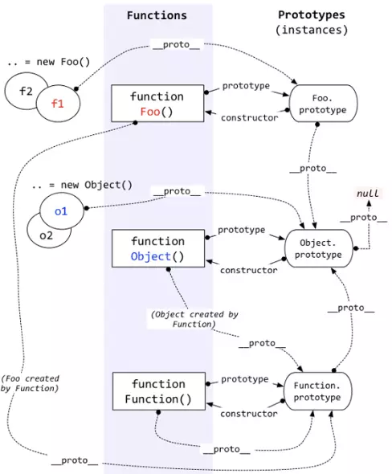
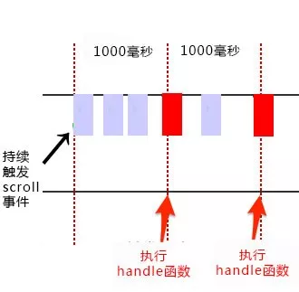
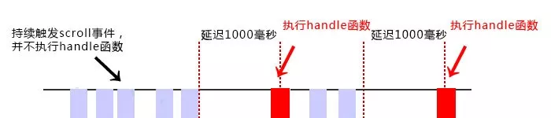
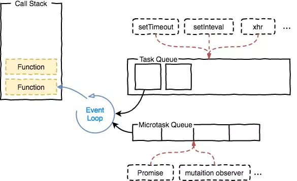
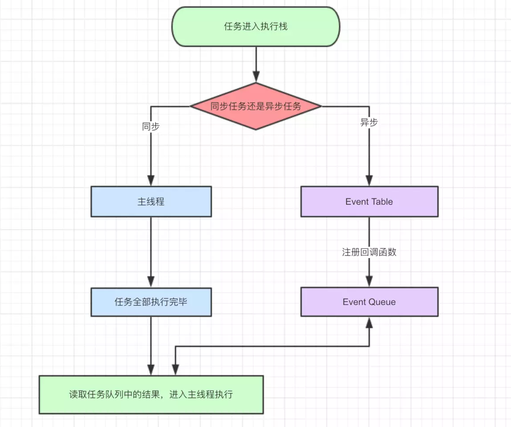
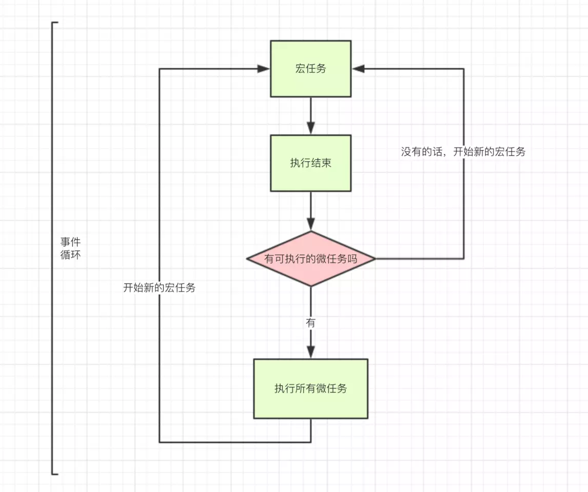

# - 阶段性总结，查漏补缺
## 目录
- [js css html](#1-js-css-html)
  - [js](#11-javascript)
  - [css](#12-css)
  - [html](#13-html)
- [浏览器](#2-浏览器)
## 1.js css html
## 1.1 javascript
 - 基本数据类型
    - undefiend
    - null
    - boolean
    - number
    - string
    - object
    - symbol
 - 内置对象
    - Array操作
    - String操作
 - 基本代码规范
 - call/apply/bind
   #### call()
    - call() 方法调用一个函数,其具有一个指定的this值和分别地提供的参数(参数的列表)。
    - 语法fun.call(thisArg, arg1, arg2, ...)
      thisArg
    在fun函数运行时指定的this值。需要注意的是，指定的this值并不一定是该函数执行时真正的this值，<b>如果这个函数处于非严格模式下，则指定为null和undefined的this值会自动指向全局对象(浏览器中就是window对象)，</b>同时值为原始值(数字，字符串，布尔值)的this会指向该原始值的自动包装对象。
    - 返回值：你调用的方法的返回值，若该方法没有返回值，则返回undefined。
   #### apply()
    - apply() 方法调用一个函数, 其具有一个指定的this值，以及作为一个数组（或类似数组的对象）提供的参数。
    - func.apply(thisArg, [argsArray])
    - 返回值：调用有指定this值和参数的函数的结果。
   call()方法的作用和 apply() 方法类似，只有一个区别，就是 call()方法接受的是若干个参数的列表，而apply()方法接受的是一个包含多个参数的数组
   #### bind()
   bind() 函数会创建一个新函数（称为绑定函数），新函数与被调函数（绑定函数的目标函数）具有相同的函数体（在 ECMAScript 5 规范中内置的call属性）。当新函数被调用时 this 值绑定到 bind() 的第一个参数，该参数不能被重写。绑定函数被调用时，bind() 也接受预设的参数提供给原函数。一个绑定函数也能使用new操作符创建对象：这种行为就像把原函数当成构造器。提供的 this 值被忽略，同时调用时的参数被提供给模拟函数
   - fun.bind(thisArg[, arg1[, arg2[, ...]]])
    thisArg
    当绑定函数被调用时，该参数会作为原函数运行时的 this 指向。当使用new 操作符调用绑定函数时，该参数无效。
   - 返回值：由指定的this值和初始化参数改造的原函数拷贝。<b>需要手动调用</b>
   - 使用场景
     - 创建绑定函数：bind() 最简单的用法是创建一个函数，使这个函数不论怎么调用都有同样的 this 值。
     - 偏函数：bind()的另一个最简单的用法是使一个函数拥有预设的初始参数。这些参数（如果有的话）作为bind()的第二个参数跟在this（或其他对象）后面，之后它们会被插入到目标函数的参数列表的开始位置，传递给绑定函数的参数会跟在它们的后面。
     - 配合setTimeout:在默认情况下，使用 window.setTimeout() 时，this 关键字会指向 window （或全局）对象。当使用类的方法时，需要 this 引用类的实例，你可能需要显式地把 this 绑定到回调函数以便继续使用实例。
   <pre>
    underscore.js
       _.bind = function (func, context) {
            if (nativeBind && func.bind === nativeBind) return nativeBind.apply(func, slice.call(arguments, 1));
            if (!_.isFunction(func)) throw new TypeError('Bind must be called on a function');
            var args = slice.call(arguments, 2);
            var bound = function () {
                return executeBound(func, bound, context, this, args.concat(slice.call(arguments)));
            };
            return bound;
        };
    _.bindAll(obj)：绑定对象 obj 的所有指定成员方法中的执行上下文到 obj
    _.bindAll = function (obj) {
        var i, length = arguments.length,
            key;
        if (length <= 1) throw new Error('bindAll must be passed function names');
        for (i = 1; i < length; i++) {
            key = arguments[i];
            obj[key] = _.bind(obj[key], obj);
        }
        return obj;
    };
    e.g.
    var button = {
        title: 'button#1',
        onClick: function() {
            console.log(this.title + ' has been clicked!');
        },
        onHover: function() {
            console.log(this.title + ' hovering!');
        }
    }
    _.bindAll(button, 'onClick', 'onHover');
    setTimeout(button.onClick, 0);
    setTimeout(button.onHover, 0);
    // => "button#1 has been clicked!"
    // => "button#1 hovering!"
   </pre>
 
 - this工作原理
   #### <b>this指向最后调用它的那个对象，没有调用的对象就是全局对象，浏览器中是window</b>
   改变this指向的方法：
   - 使用箭头函数
     箭头函数的this始终指向函数定义时的this,而不是执行时。箭头函数中没有 this 绑定，必须通过查找作用域链来决定其值，如果箭头函数被非箭头函数包含，则 this 绑定的是最近一层非箭头函数的this，否则，this 为 undefined
   - 在函数内部使用 _this = this
     保存调用函数的对象在函数内部的_this中
   - 使用apply call bind
   - new实例化一个对象
 - 原型/原型链
    

      
    

 - 值的类型/内存图
    
 - 继承
 - 创建对象方式
 - null/undefined
 - 通用的事件监听函数
 - parseInt
 - 闭包
 - new操作符
    new constructor[([arguments])]
    当代码 new Foo(...) 执行时，会发生以下事情：
    - 创建一个空对象 obj（一个继承自 constructor.prototype 的新对象）;
    - 将新创建的空对象的隐式原型指向其构造函数的显示原型。
    - 使用 call 改变 this的指向
    - 如果无返回值或者返回一个非对象值，则将 obj返回作为新对象；如果返回值是一个新对象的话那么直接直接返回该对象
 - 函数调用
    - 作为函数调用
        一个最简单的全局函数，不属于任何一个对象，就是一个函数，这样的情况浏览器中的非严格模式默认是属于全局对象window的，在严格模式，就是 undefined。 
    - 作为方法调用
       函数作为一个对象的方法被调用
    - 使用构造函数调用
        new操作符调用构造函数创建一个对象
    - 作为函数方法调用函数(apply call)
 - 函数防抖/节流
   - 节流 throttle
    

      
    

    思想：
    某些函数不可以无间断的连续重复执行。
    第一次调用，设定定时器，再指定时间间隔之后执行
    第二次调用，先清除之前的定时器，重新设置一个定时器，
    <pre>underscore.js节流源码
    /**
     * 返回一个节流函数，该函数的执行频率会被严格限制，
     * @param func
     * @param wait 等待时间
     * @param options 一些配置
    */
    _.throttle = function (func, wait, options) {
        // 本质上还是通过setTimeout()方法来实现间隔调用的
        // timeout标识最近一次被追踪的调用
        // context和args缓存func执行时需要的上下文，result缓存func执行的result
        var timeout, context, args, result;
        // 最近一次func被调用的时间点
        var previous = 0;
        if (!options) options = {};
        // 创建一个延后执行的函数包裹住func的执行过程， 使得func能够在
        var later = function () {
            // 执行时，刷新最近一次调用时间
            previous = options.leading === false ? 0 : _.now();
            // 清空定时器
            timeout = null;
            result = func.apply(context, args);
            if (!timeout) context = args = null;
        };
        // 返回一个throttled的函数
        var throttled = function () {
            // ----- 节流函数开始执行----
            // 我们尝试调用func时，会首先记录当前时间戳
            var now = _.now();
            // 是否是第一次调用
            if (!previous && options.leading === false) previous = now;
            // func还要等待多久才能被调用 =  预设的最小等待期-（当前时间-上一次调用的时间）
            // 显然，如果第一次调用，且未设置options.leading = false，那么remaing=0，func会被立即执行
            var remaining = wait - (now - previous);
            // 记录之后执行时需要的上下文和参数
            context = this;
            args = arguments;
            // 如果计算后能被立即执行
            if (remaining <= 0 || remaining > wait) {
                // 清除之前的“最新调用”
                if (timeout) {
                    clearTimeout(timeout);
                    timeout = null;
                }
                // 刷新最近一次func调用的时间点
                previous = now;
                // 执行func调用
                result = func.apply(context, args);
                // 如果timeout被清空了，
                if (!timeout) context = args = null;
            } else if (!timeout && options.trailing !== false) {
                // 如果设置了trailing edge，那么暂缓此次调用尝试的执行
                timeout = setTimeout(later, remaining);
            }
            return result;
        };
        // 可以取消函数的节流化
        throttled.cancel = function () {
            clearTimeout(timeout);
            previous = 0;
            timeout = context = args = null;
        };
        return throttled;
    }; 
    </pre>

   - 防抖 debounce
    

      
    

    underscore.js防抖源码
    <pre>
    /**
     * throttle函数的防抖版本
     * 从下面的debounce实现我们可以看到，
     * 不同于throttle，debounce不再计算remain时间，
     * 其提供的__immediate__参数类似于throttle中的对于leading-edge和trailing-edge的控制：
     *
     * - immediate === true，开启leading-edge，当可以执行时立即执行
     * - immediate === false（默认）开启trailing-edge，当可以执行时也必须延后至少wait个时间才能执行。
     *
     * 因此，debounce后的func要么立即获得响应，要么延迟一段时间才响应，
     * @param {Function} func 需要防止反跳的函数
     * @param {Number} wait 等待时间
     * @param {Boolean} immediate 是否允许立即执行，如果设置为true，那么如果之前的调用都执行完毕，本次调用可以立即执行
     *
     */
    _.debounce = function (func, wait, immediate) {
        var timeout, result;
        var later = function (context, args) {
            timeout = null;
            if (args) result = func.apply(context, args);
        };
        var debounced = restArgs(function (args) {
            // 一旦存在timeout， 意味之前尝试调用过func
            // 由于debounce只认最新的一次调用， 所以之前等待执行的func都会被终止
            if (timeout) clearTimeout(timeout);
            // 如果允许新的调用尝试立即执行，
            if (immediate) {
                // 如果之前尚没有调用尝试，那么此次调用可以立马执行，否则一定得等待之前的执行完毕
                var callNow = !timeout;
                // 刷新timeout
                timeout = setTimeout(later, wait);
                // 如果能被立即执行，立即执行
                if (callNow) result = func.apply(this, args);
            } else {
                // 否则，这次尝试调用会延时wait个时间
                timeout = _.delay(later, wait, this, args);
            }
            return result;
        });
        debounced.cancel = function () {
            clearTimeout(timeout);
            timeout = null;
        };
        return debounced;
    };
    </pre>
    使用debounce，throttle和requestAnimationFrame优化你的事件处理程序。每种技术都略有不同，但它们都有用，互补。
    综上所述：
    防抖：将突发事件（如击键）分组为一个单一的事件。
    节流：每X毫秒保证持续的执行流量。就像每200毫秒检查一次滚动位置来触发CSS动画。
    requestAnimationFrame：节流替代品。当你的函数重新计算和渲染屏幕上的元素，并且你想保证平滑的变化或动画。注意：不支持IE9。
 - 参数验证
 - 函数柯里化
## 1.2 css
 - 盒模型
 - 多列布局
   [常见布局](https://www.sweet-kk.top/css-layout/#/)
 - 水平居中/垂直居中
 - 选择器/属性继承
 - 选择器优先级
 - css3新增伪类
 - display
 - position
 - css3新特性
 - 兼容性
 - BFC(Block Formatting Context)规范
    ###### 块格式上下文是页面CSS视觉渲染的一部分，用于决定块盒子的布局及浮动相互影响范围的一个区域。一个BFC包含创建该上下文元素的所有子元素，但不包括创建了新BFC的子元素的内部元素，即一个元素不能同时存在两个BFC中。
    ###### 视觉格式化模型(visual formatting model)是用来处理文档并将它显示在视觉媒体上的机制，它也是CSS中的一个概念。视觉格式化模型定义了盒（Box）的生成，盒主要包括了块盒、行内盒、匿名盒（没有名字不能被选择器选中的盒）以及一些实验性的盒（未来可能添加到规范中）。盒的类型由display属性决定。
   - block box
    `display:block`,参与BFC,垂直排列,block-level,
   - inline box
     - `display :inline-block;inline-block;inline-table`，水平排列
     - inline-level-boxes参与行内格式化上下文(inline formatting context)。同时参与生成行内格式化上下文的行内级盒称为行内盒(inline boxes)。所有display:inline的非替换元素生成的盒是行内盒
     - 不参与生成行内格式化上下文的行内级盒称为原子行内级盒(atomic inline-level boxes)。这些盒由可替换行内元素，或 display 值为 inline-block 或 inline-table 的元素生成，不能拆分成多个盒
   - anonymous box
    匿名盒也有份匿名块盒与匿名行内盒，因为匿名盒没有名字，不能利用选择器来选择它们，所以它们的所有属性都为inherit或初始默认值
   - 定位
     ###### box是定位的基本单位
     - 常规流
     - 静态定位，常规流的box位置
     - 相对定位，box位置偏离原来的位置但是原位置仍保留
   - 浮动
     - 位于当前行的开头或者末尾
     - 影响常规流布局，导致常规流环绕在它的周围，除非clear
   - 绝对定位
     - box从常规流中移除，不影响常规流布局
     - `position:absolute;fixed`
     - `absolute`相对于最近的一个属性`absolute/relative/fixed`的父元素，不存在的话就是body
   - 创建BFC
     - 根元素或者包含它的元素
     - `float 不为 none`的元素
     - `position:absolute/fixed`
     - 非块级box容器`display:table-cell，table-caption，inline-block, flex, inline-flex`
     - 表格单元格
     - `overflow不是visible`
     - flex boxes `display:flex;inline-flex`
   ###### BFC特性
   - 同一个BFC中的元素相互影响可能发生margin collapse
    <pre>可以通过创建新的BFC来解决margin叠加</pre>
    [margin collapse](http://jsrun.net/YqgKp/edit)
   - 同一个BFC中每个盒子的margin-left的左边与容器块border-left的左边相接触（从左到右）浮动存在也如此
   - BFC区域不会和float box叠加
    <pre>和float box同级创建一个BFC就可以进行两栏布局
    </pre>
    [布局](http://jsrun.net/kqgKp/edit)
   - BFC在页面上是独立的容器，处于BFC内部的元素与外部的元素相互隔离，
   使内外元素的定位不会相互影响
   - 计算BFC高度时，考虑其包含的全部元素包括浮动元素
   <pre>float box的父容器创建BFC避免塌陷</pre>
   [float box 父容器高度](http://jsrun.net/pqgKp/edit)
    
 - css阻塞
 - hack写法
 - 初始化css样式
 - 伪类/伪元素
## 1.3 html
 - 语义化标签
 - canvas
 - video/audio
 - localStorage/sessionStorage
 - webWorker/webSocket/Geolocation
 - iframe
 - 兼容性
## 2. 浏览器
 - 描述一个网页从请求到显示的完整过程
 - 浏览器内核
 - 浏览器内多个标签页之间的通信
 - webSocket如何兼容低浏览器
 - 跨域
 - 重排/重绘
 - 检测浏览器版本
 - 错误类型
## 5. JSON
## 6. AJAX
 - 创建ajax
 - callback类型
## 7. ECMAScript6
 - ES6 class
 - 同步/异步
## 8. 模块规范
 [模块化](http://huangxuan.me/js-module-7day/#/)
 - CommonJS
 - AMD
 - CMD
## 9. 框架
 - MVC
 - MVVM
## 10. HTTP/HTTPS
 - 状态码
 - 缓存
   #### 缓存是用来缓解服务器端压力、提升性能、减少带宽消耗，请求资源的副本存储下来的技术。
   - 缓存截止到下一次发生改变
   - 私有缓存 共享缓存
   <pre>Cache-Control: private Cache-Control: public</pre>

   - 浏览器缓存
     ###### 浏览器对于缓存的处理是根据第一次请求资源时返回的<b>响应头</b>来确定的。浏览器对于请求资源, 拥有一系列成熟的缓存策略. 按照发生的时间顺序分别为<b>存储策略</b>, <b>过期策略</b>, <b>协商策略</b>, 其中存储策略在收到响应后应用, 过期策略, 协商策略在发送请求前应用
   - 代理缓存---共享
   - 网关、CDN、反向代理缓存和负载均衡
   ##### 缓存控制

    

      
    

   <pre> 

     - cache-control 通用头
        请求指令
        Cache-Control: must-revalidate缓存验证，用户点击刷新就开始缓存验证，缓存的响应头里面有该字段
        Cache-Control: max-age=31536000 缓存过期的相对时间
        Cache-Control: no-store  不缓存请求或响应内容
        Cache-Control: no-cache  强制源服务器再次验证
        Cache-Control: min-fresh 期望在指定时间内响应仍然有效
        Cache-Control: no-transform   代理不可更改媒体类型
        Cache-Control: only-if-cached 从缓存获取
        Cache-Control: extension
        响应指令
        Cache-Control: public
        Cache-Control: private
        Cache-Control: no-cache     缓存前必须先确认其有效性
        Cache-Control: no-store
        Cache-Control: no-transform
        Cache-Control: must-revalidate 可缓存但必须再向源服务器进确认
        Cache-Control: proxy-revalidate 要求中间缓存服务器对缓存的响应有效性再进行确认
        Cache-Control: max-age
        Cache-Control: s-maxage 公共缓存服务器响应的最大Age值
        Cache-Control: cache-extension 
     - Date 通用头 创建报文的时间
     - pragma 存储策略 通用头 同Cache-Control: no-cache 强制验证缓存 1.0版本字段 Pragma的优先级高于Cache-Control和Expires
     - Age 响应头 资源在缓存代理中的时间取决于max-age 用来区分请求的资源来自源服务器还是缓存服务器的缓存的
     - Vary 响应头 缓存服务器会以User-Agent和 Accept-Encoding两个请求首部字段来区分缓存版本。根据请求头里的这两个字段来
     决定返回给客户端什么内容 
    
     ###### 协商策略 浏览器对资源做重新检查验证的时候会使用到。过期但可用：返回304无实体响应；过期不可用：返回请求实体
     - Etag 响应头, 服务器生成资源的唯一标识， 缓存的强校验器，对代理不透明 。之后客户端请求头If-None-Match值等于Etag 可验证缓存
     - Last-Modified 实体头,最后一次修改时间弱校验器（精确到1s）之后客户端请求头 If-Modified-Since值等于Last-Modified验证本地缓存是否可用
     ###### 过期策略
     - Expires 实体头 缓存过期的绝对时间
   </pre>

    ###### 如果响应头中没有可以用来判断缓存是否过期的字段，但是有Date和Last-Modified,可以用其差值的10%来用作缓存周期
## 11. web安全
 - XSS
 - SQL注入
 - CSRF
 - 
## 12. web Api
- DOM
  - 事件
    
    ##### Event-loop是js的runtime执行机制（不同环境执行方式有所不同：node,浏览器） JavaScript 的一个非常有趣的特性是事件循环模型，与许多其他语言不同，它永不阻塞（例外：如 alert或者同步 XHR）,用来实现异步。处理 I/O 通常通过事件和回调来执行，所以当一个应用正等待IndexedDB查询返回或者一个XHR请求返回时，它仍然可以处理其它事情，如用户输入。
    

      
    

    - 栈（stack） : 函数调用会形成了一个栈帧,帧中包含函数的参数和局部变量，调用下一个函数时，第二帧就会创建压在第一帧上，当最上面的函数返回时，这一帧就被弹出栈，全部返回栈为空。
    - 堆（heap）:对象被分配在一个堆中，一个用以表示一个内存中大的未被组织的区域。
    - 队列（queue）：一个JavaScript运行时包含了一个待处理的消息队列。事件注册的回调函数
    ###### 每一个消息都与一个函数相关联。当栈为空时，则从队列中取出一个消息进行处理。这个处理过程包含了调用与这个消息相关联的函数（以及因而创建了一个初始堆栈帧）。当栈再次为空的时候，也就意味着该消息处理结束。
    

      
    

      <pre>
      macro-task(宏任务)：包括整体代码script setTimeout setInterval I/O UI交互事件； 
      micro-task(微任务)：Promise process.nextTick MutaionObserver 
      不同类型的任务会进入对应的Event Queue，比如setTimeout和setInterval会进入相同的Event Queue 
      执行顺序：整体代码---所有微任务Queue---第一轮循环结束---宏任务Queue---所有微任务Queue---... 
      node环境Node的Event Loop分阶段，阶段有先后，依次是

      - expired timers and intervals，即到期的setTimeout/setInterval
      - I/O events，包含文件，网络等等
      - immediates，通过setImmediate注册的函数
      - close handlers，close事件的回调，比如TCP连接断开
      同步任务及每个阶段之后都会清空microtask队列
      - 优先清空next tick queue，即通过process.nextTick注册的函数
      - 再清空other queue，常见的如Promise
      而和规范的区别，在于node会清空当前所处阶段的队列，即执行所有task
      </pre>
      

      
    

    [代码](http://jsrun.net/zqgKp/edit)

   ###### 异步函数A(args..., callbackFn)  A：发起函数(注册函数)发起异步过程  callbackFn：回调函数 处理结果
   - setTimeout
   调用 setTimeout 函数在指定时间之后在队列中添加一个消息/回调函数/任务。这个时间段作为函数的第二个参数被传入。如果队列中没有其它消息，消息会被马上处理。但是，如果有其它消息，setTimeout消息必须等待其它消息处理完。因此第二个参数仅仅表示最少的时间 而非确切的时间
   - setInterval
   每隔指定的时间将任务添加到队列中，至于什么时候执行取决于队列中之前的任务是否处理完成
   - Promise与process.nextTick(callback)
   - setImmediate