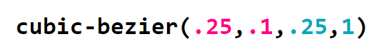

### 过渡&动画&变形

 <b>animation&transform&transition css rule</b>  
 
  属性名|语法
  -|-
  animation|name duration timing-function delay iteration-count direction fill-mode play-state;
  @keyframes|animationname {keyframes-selector {css-styles;}}
  transform|transfrom-functions
  transform-origin|更改转换元素基点坐标的位置，元素本身 必须先使用tranform x-axis(left center right length %) y-axis(top center bottom length %) z-axis(length)默认值50%，50%，0
  transform-style|属性指定嵌套元素是怎样在三维空间中呈现 必须先使用transform flat or preserve-3d
  transition|property(css属性 eg width) duration(持续时间) timing-function(转速曲线) delay(效果开始的时间)
  
  > keyframes-selector 必需的。动画持续时间的百分比。合法值：0-100% from(和0%相同) to (和100%相同)
  
  > 用transition进行过渡时注意指定过渡属性，因其过渡默认属性值为all不指定的话所有可以过渡的属性都会出现过渡效果。另外，可以通过transition-delay（transition简写中是第二个时间值）属性把各个属性的过渡过程排成队列。e.g.:先过渡高度再过渡宽度，transition:.5s height,.8s .5s(delay=before duration) width
  
  animation-property|值|说明
  -|-|-
  animation-name|keyframename or none|关键帧名称@keyframes定义
  animation-duration|time|多长时间完成秒或者毫秒为单位
  animation-timing-function|同transition-timing-functione.g.三次贝塞尔曲线cubic-bezier(x1,y1,x2,y2) or steps()|如何完成一个周期作用于每两个关键帧之间，而不是整个动画
  animation-delay|time|启动之前的延迟
  animation-iteration-count|n or infinite无限次|播放次数
  animation-direction|normal 正常播放 reverse反向播放 alternate奇数次正向偶数次反向 alternate-reverse奇数次反向偶数次正向 initial inherit|是否轮流反向播放
  animation-fill-mode|none 动画播放之前之后都不会应用任何样式到目标元素 forwards 动画结束后应用该属性值 backwards启动动画的第一次迭代的关键帧中定义的属性值 both|不播放时，启动之前或者完成之后的样式
  animation-play-state|pause or running|控制动画状态运行或者暂停
  initial||默认值
  inherit||继承父元素
  
 > [cubic-bezier((x1,y1,x2,y2)](http://cubic-bezier.com)分别代表两个控制锚点的坐标值,我们通过这两个控制锚点来指定想要的贝塞尔曲线. 语法形式是这样的:cubic-bezier(x1, y1, x2, y2),其中 (x1, y1) 表示第一个控制锚点的坐标,而 (x2, y2) 是第二个。曲线片断的两个端点分别固定在(0,0) 和 (1,1),前者是整个过渡的起点（时间进度为零,动画进度为零）,后者是终点（时间进度为 100%,动画进度为 100%）。把控制锚点的水平坐标和垂直坐标互换， 就可以得到任何调速函数的反向版本
 

    
    

 > steps 函数指定了一个阶跃函数第一个参数指定了时间函数中的间隔数量（必须是正整数）第二个参数可选，接受 start 和 end 两个值，指定在每个间隔的起点或是终点发生阶跃变化，默认为 end。step-start等同于steps(1,start)，动画分成1步，动画执行时为开始左侧端点的部分为开始；step-end等同于steps(1,end)：动画分成一步，动画执行时以结尾端点为开始，默认值为end。2个参数都会选择性的跳过前后部分，start跳过0%，end跳过100%step-start在变化过程中，都是以下一帧的显示效果来填充间隔动画，所以0% 到 50%,step-end与上面相反，都是以上一帧的显示效果来填充间隔动画，所以0% 到 50%
 
 > backwards:当 animation-direction 为 "normal" 或 "alternate" 时是 from 关键帧中的值,当 animation-direction 为 "reverse" 或 "alternate-reverse" 时是to关键帧中的值
  
  transform-function|说明
  -|-
  none|	定义不进行转换。
  matrix(n,n,n,n,n,n) |	定义 2D 转换，使用六个值的矩阵。
  matrix3d(n,n,n,n,n,n,n,n,n,n,n,n,n,n,n,n)|定义 3D 转换，使用 16 个值的 4x4 矩阵。
  translate(x,y)|定义 2D 转换。
  translate3d(x,y,z)|	定义 3D 转换。
  translateX(x)|	定义转换，只是用 X 轴的值。
  translateY(y)|	定义转换，只是用 Y 轴的值。
  translateZ(z)	|定义 3D 转换，只是用 Z 轴的值。
  scale(x[,y]?)	|定义 2D 缩放转换。
  scale3d(x,y,z)|	定义 3D 缩放转换。
  scaleX(x)|	通过设置 X 轴的值来定义缩放转换。
  scaleY(y)|	通过设置 Y 轴的值来定义缩放转换。
  scaleZ(z)|	通过设置 Z 轴的值来定义 3D 缩放转换。
  rotate(angle)|	定义 2D 旋转，在参数中规定角度 0-360deg 0-1turn
  rotate3d(x,y,z,angle)|	定义 3D 旋转。
  rotateX(angle)|	定义沿着 X 轴的 3D 旋转。
  rotateY(angle)|	定义沿着 Y 轴的 3D 旋转。
  rotateZ(angle)|	定义沿着 Z 轴的 3D 旋转。
  skew(x-angle,y-angle)	|定义沿着 X 和 Y 轴的 2D 倾斜转换。
  skewX(angle)|	定义沿着 X 轴的 2D 倾斜转换。
  skewY(angle)|	定义沿着 Y 轴的 2D 倾斜转换。
  perspective(n)|	为 3D 转换元素定义透视视图。
  
  transition-property|说明
  -|-
  transition-property|none or all（全部属性） or property
  transition-duration|time以秒或者毫秒为单位
  transition-timing-function|linear（相同速度cubic-bezier(0,0,1,1)）  ease（开始慢-变快-结束慢cubic-bezier(0.25,0.1,0.25,1)）  ease-in（慢开始cubic-bezier(0.42,0,1,1)）  ease-out（慢结束cubic-bezier(0,0,0.58,1)）  ease-in-out（开始慢-结束慢cubic-bezier(0.42,0,0.58,1)）  cubic-bezier(n,n,n,n)n取[0,1]
  transition-delay|time
#### animation example
##### 1. 缓动效果（&transition）
  - 位移变化 模拟小球下落回弹的过程
  - 尺寸变化 鼠标悬停变大、弹框缓慢弹出、图形元素动态变化[demo](http://jsrun.net/9egKp/edit)
  - 角度变化 饼图扇区从0度开始展开到实际大小
##### 2. 逐帧动画
##### 3. 闪烁效果
  - 页面需要通过闪烁提示用户[demo](http://jsrun.net/negKp/edit)

    

##### 4. 打字动画[demo](http://jsrun.net/RegKp/edit)
 > 模拟打字效果，文字逐个显示。思路动画主体为容器宽度，文字包裹在容器中，让其宽度从0开始以steps的方式一个一个变为本身的宽度,光标的闪烁和文字的动画分开
##### 5. 状态平滑的动画[demo](http://jsrun.net/MegKp/edit)
动画的触发条件不确定循环次数无法控制，当动画停止时停留在当前状态或者平滑的过渡到开始状态
##### 6. 沿环形路径平移的动画（&transform）
涉及到点 平行四边形，菱形图片 闪烁 动画 变形
#### transform example
##### 1. 平行四边形[demo](http://jsrun.net/4EgKp/edit)
  内容正向，容器是平行四边形2中方式：
  - 内容加一层div,容器逆向旋转45deg 内容旋转45deg
  - 用伪元素表现样式，背景 边框 等然后对伪元素进行变形，因为内容不再伪元素中所以内容不会受到变形影响，伪元素继承宿主元素尺寸问题解决：宿主元素position:relative伪元素position:absolute然后所有偏移量设为0。伪元素叠加在内容之上用z-index解决
##### 2. 菱形图片（&transition）[demo]()
> polygon()函数用于定义一个多边形。它的参数是一组坐标对（<shape-arg> <shape-arg>），每一个坐标对代表多边形的一个顶点坐标。浏览器会将最后一个顶点和第一个顶点连接得到一个封闭的多边形。坐标对使用逗号来进行分隔，可以使用绝对单位或百分比单位值.除了坐标对参数，polygon()函数还可以使用一个可选的关键字fill-rule。该关键字指定如何处理可能相交的多边形形状的区域。可取值有nonzero 和evenodd。默认值为nonzero
- 涉及到点对img应用clip-path:polygon();用transition：1s clip-path进行缓动处理
##### 3. 切角效果（&transition）[demo](http://jsrun.net/TsgKp/edit)

    

思路：四块单切角矩形(1/4大小)组成，从切角深度处开始透明线性渐变，背景色从0（小于切角深度即可）开始线性渐变

##### 4. 梯形标签页
##### 5. 饼图
##### 6. 折角效果
##### 7. 交互式图片对比控件
##### 8. 垂直居中
#### transition example
##### 1. 染色效果
##### 2. 模糊弱化背景
