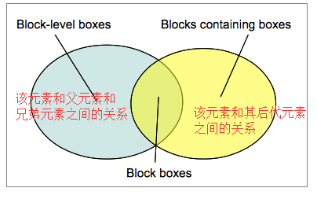

#### css视觉格式化模型
> 视觉格式化模型是用来处理和在视觉媒体上显示文档时使用的计算规则,会根据CSS盒子模型将文档中的元素转换为一个个盒子，每个盒子的布局由以下因素决定：

- 盒子的尺寸：精确指定、由约束条件指定或没有指定
- 盒子的类型：行内盒子（inline）、行内级盒子（inline-level）、原子行内级盒子（atomic inline-level）、块盒子（block）
- 定位方案（positioning scheme）：普通流定位、浮动定位或绝对定位
- 文档树中的其它元素：即当前盒子的子元素或兄弟元素
- 视口尺寸与位置
- 所包含的图片的尺寸
- 其他的某些外部因素
该模型会根据盒子的包含块（containing block）的边界来渲染盒子。通常，盒子会创建一个包含其后代元素的包含块，但是盒子并不由包含块所限制，当盒子的布局
跑到包含块的外面时称为溢出（overflow）。
> 盒模型是网页布局的基础，每个元素都被表示为一个矩形的方框。

术语|说明
-|-
block|<b>块</b> 一个块在文档流上占据一个独立的区域，块与块之间在垂直方向上按照顺序依次堆叠
containing block|<b>包含块</b> 包含其他盒子的块
box|<b>盒子</b> 盒子与元素不一一对应，有时多个元素合并生成一个box，有时一个元素生成多个box eg匿名盒子 由css引擎根据文档内容创建，主要用于文档元素的定位、布局、格式化
block-level element|<b>块级元素</b> display属性为block,list-item,table时，该元素为块级元素。 元素是否是块级元素仅是元素本身的属性，并不直接用于格式化上下文的创建或布局
block-level box|<b>块级盒子</b> 由块级元素生成，一个块级元素至少生成一个块级盒子，也可能生成多个eg列表项元素, 包含后代元素生成的盒子以及内容参与BFC、定位方案
block box|<b>块盒子</b> 具名块盒子、匿名块盒子 如果一个块级盒子同时也是一个块容器盒子就成为块盒子，匿名块盒子无法被css选择符选中
block container box|<b>块容器盒子</b> 仅用来描述当前盒子与其后代的关系，主要用于确定其子元素的定位布局，不参与当前块的布局和定位
inline-level element|<b>行内级元素</b> display属性为inline,inline-block,inline-table的元素为行内级元素 元素是否是行内级元素仅是元素本身的属性，并不直接用于格式化上下文的创建或布局
inline-level box|<b>行内级盒子</b> 由行内级元素生成，<b>行内盒子、原子行内级盒子</b>区别在于是否参与行内格式化上下文IFC的创建
inline box|<b>行内盒子</b>参与IFC创建，行内盒子也分为具名行内盒子和匿名行内盒子（anonymous inline box）两种
atomic inline-level box|<b>原子行内级盒子</b>不参与IBF，原子行内级盒子的内容不会拆分成多行显示

    

##### 关于包含块

> 一个元素的基本属性经常受其包含块的影响。大多数情况下，包含块就是这个元素最近的祖先块元素的内容区，但也不是总是这样。元素受包含块影响的属性

- height top bottom的百分值是通过包含块的height,如果包含块的高度根据内容变化且position:relative or static 这些值都为0 
- padding margin width left right 都由包含块的width计算百分值
- position:fixed or absolute绝对定位元素偏移值，值为百分比时参考的就是包含块

> 如何确定包含块-----包含块的position属性值

- position:static or relative 包含块为离该元素最近的祖先块元素 or 格式化上下文（table container,flex container,grid container,the block container itself）内容区的边缘组成
- position；absolute包含块为离该元素最近的position属性不为static的祖先元素的内边距区域组成
- position: fixed包含块为viewport或者page area
- position:absolute or fixed 包含块也可能是由满足以下条件的最近父级元素的内边距区的边缘组成的
  1. transform or persoective 的值不是none
  2. transform or persoective 的值会改变
  3. filter的值不是none 或者filter的值会改变
- 根元素是初始包含块

#### 两种盒模型

    

    

- 早期IE在一种怪异模式下的解析方式，也是现在的border-box 也称简单盒模型。width = border+padding+content_width;height = border+padding+content_height
- 后来W3C标准规定标准解析模式下使用标准盒模型，content-box width = content_width;height = content_height

> css3新的属性box-size可以用来改变盒模型宽高度范围 box-size:border-box为怪异模式 border-size:content-box为标准模式

#### 盒模型自身相关属性

属性名|值|说明
-|-|-
width||宽度min-width max-width
height||高度min-height max-height
padding||内边距
border||边框
margin||外边距
overflow|auto hidden visible inherit none|内容溢出控制
background-clip||背景颜色和背景图片渲染区域控制
border-sizing|content-box or border-box|模型切换
display|block inline-block inline 匿名盒子|盒子类型
