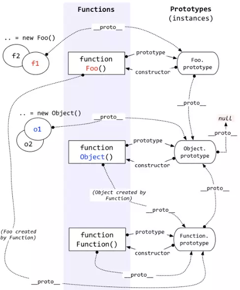

    

### 构造函数&原型对象&实例对象

> 每个构造函数都有prototype一个原型对象，每个原型对象都有一个constructor属性指向构造函数,每个实例对象都有一个内部属性__proto__指向原型对象.所有的构造器都继承于Function.prototype,甚至包括根构造器Object及Function自身。所有构造器都继承了Function.prototype的属性及方法.所有的构造器既是函数也是一个普通JS对象，可以给构造器添加/删除属性等。同时它也继承了Object.prototype上的所有方法：toString、valueOf、hasOwnProperty等。

<pre>
这里列举了可访问的9个内置构造器.2个内置对象。剩下如Global不能直接访问，Arguments仅在函数调用时由JS引擎创建，无需new。
console.log(Number.__proto__ === Function.prototype); // true
console.log(Boolean.__proto__ === Function.prototype); // true
console.log(String.__proto__ === Function.prototype); // true
console.log(Object.__proto__ === Function.prototype); // true
console.log(Function.__proto__ === Function.prototype); // true
console.log(Array.__proto__ === Function.prototype); // true
console.log(RegExp.__proto__ === Function.prototype); // true
console.log(Error.__proto__ === Function.prototype); // true
console.log(Date.__proto__ === Function.prototype); // true
console.log(Math.__proto__ === Object.prototype);  // true
console.log(JSON.__proto_  === Object.prototype);  // true

Function.prototype函数构造器的原型对象是什么？其他内置构造器的原型对象是什么？
console.log(typeof Function.prototype) // *"function"

console.log(typeof Number.prototype)   // object
console.log(typeof Boolean.prototype)  // object
console.log(typeof String.prototype)   // object
console.log(typeof Object.prototype)   // object
console.log(typeof Array.prototype)    // object
console.log(typeof RegExp.prototype)   // object
console.log(typeof Error.prototype)    // object
console.log(typeof Date.prototype)     // object
console.log(Function.prototype.__proto__ === Object.prototype) // true
console.log(Object.prototype.__proto__ === null) 

<b>Object的三重身份，函数，对象，构造器</b>
</pre>

一切从null开始....
先有的一定是Object，它是BOM对象，function Object() { [native code] }，然后才是Object.prototype。这不矛盾，首先：Object.create(null)，它可以创建一个没有原型的对象。如下：Object.prototype.__proto__ == Object.create(null).__proto__结果为true，也就是说，Object.prototype是使用这种方式生成的，然后才绑在Object的prototype属性上。为什么这里没有用===，因为__proto__指向的是对象，对象是没法比较相等的。要知道，对象可以先生成，然后再赋予新的属性。

#### 关于Function.__proto__ === Function.prototype

Function是一个函数，只要是函数，它的__proto__就指向 Funtion.prototype. 这是继承的设定。那么怎么理解这种构造器本身就继承本身的prototype属性的现象呢？Function生成时，是没有__proto__属性的，它是一个BOM对象，function Function() { [native code] }，Function.prototype同样是BOM对象，打印出来为：function () { [native code] }，那么可以这么理解：Function的__proto__和prototype属性都是后面才指向同一个BOM对象的。

#### 关于type of Function.prototype 是 function

只有Function的prototype是函数，其他都是普通对象。它是一个桥梁，函数才能是对象，关于『js中函数是一等公民』的定理，Function.prototype同时是函数, 又是原型对象便是佐证。

### 原型链是怎么形成的

- 如果让原型对象指向另一个实例对象  constructor1.prototype = instance2
- 查找一个对象的属性顺序，对象本身属性，内部属性__proto__（instance1.__proto__ = constructor1.prototype）指向的原型对象属性也就是instance2，
- 继续寻找instance2的原型对象（instance2.__proto__ = construtor2.prototype）
- 如果原型对象不是null,则继续寻找

__prototype在此有链接的作用。这样的实例与原型的链条就是原型链。

### 判断原型和实例的关系

> 1.使用 instanceof 操作符, 只要用这个操作符来测试实例(instance)与原型链中出现过的构造函数,结果就会返回true.

<pre>instance1 instanceof Object</pre>

> 2.使用 isPrototypeOf() 方法, 同样只要是原型链中出现过的原型,isPrototypeOf() 方法就会返回true, 

<pre>Object.prototype.isPrototypeOf(instance1)</pre>
