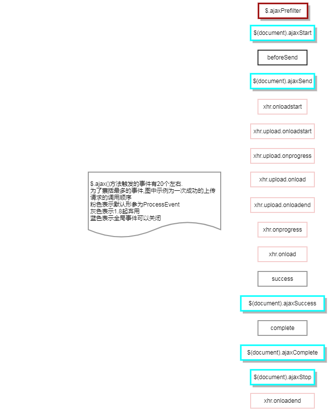
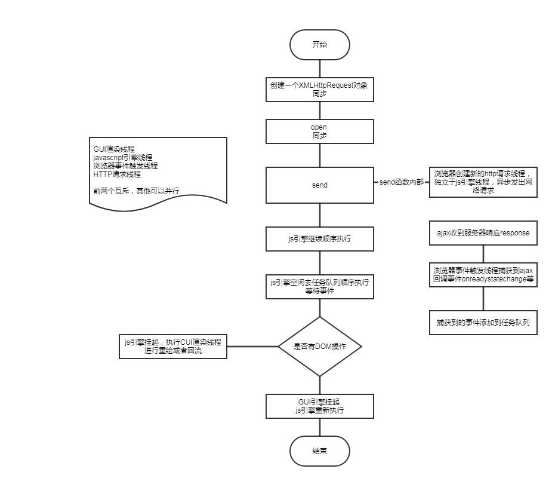

### 是什么

> Ajax 全称 Asynchronous JavaScript and XML, 即异步JS与XML. 它最早在IE5中被使用, 然后由Mozilla, Apple, Google推广开来. 典型的代表应用有 Outlook Web Access, 以及 GMail. 现代网页中几乎无ajax不欢. 前后端分离也正是建立在ajax异步通信的基础之上.标准浏览器通过XMLHttpRequest对象实现ajax功能

> new XMLHtttpRequest实例对象xhr来源追溯一下： xhr 继承自 XMLHttpRequest.prototype 继承自 XMLHttpRequestEventTarget.prototype 继承自 EventTarget.prototype 继承自 Object.prototype

### XMLHttpRequest原型属性
|属性名|类型|说明
|-|-|-
|onreadystatechange||onreadystatechange事件回调方法在readystate状态改变时触发, 在一个收到响应的ajax请求周期中, onreadystatechange 方法会被触发4次. 因此可以在 onreadystatechange 方法中绑定一些事件回调
|readyState||0	xhr.UNSENT (未初始化)	  请求已建立，未初始化。open()方法还未被调用. 1	xhr.OPENED(未发送)  请求已建立，未发送。	open()方法已经被调用，未调用send方法. 2	xhr.HEADERS_RECEIVED (已获取响应头) 请求已发送。 send()方法已经被调用, 响应头和响应状态已经返回.   3	xhr.LOADING (正在下载响应体) 请求处理中。 responseText中已经获取了部分数据. 4	xhr.DONE (请求完成)	整个请求过程已经完毕.此时可以通过responseBody和responseText获取完整的响应数据
|response||响应内容
|responseText||响应内容文本形式
|responseType||响应类型 可取 "arraybuffer" , "blob" , "document" , "json" , and "text" 共五种类型
|responseXML||xml形式响应数据
|status||http请求状态码
|status| UTF-16 的字符串|请求状态描述
|upload|默认返回一个 XMLHttpRequestUpload 对象|可以在 upload 上添加一个事件监听来跟踪上传过程。其方法见 XMLHttpRequestEventTarget事件接口属性 <pre>xhr.upload.onprogress = function(e){ var percent = 100 * e.loaded / e.total |0;  console.log('upload: ' + precent + '%'); }</pre>
|withCredentials|bool|默认false表示跨域请求中不发送cookie等，true表示cookies , authorization headers 或者TLS客户端证书 都可以正常发送和接收
|timeout|0不生效，可以转为数字的生效|用于指定ajax的超时时长. 通过它可以灵活地控制ajax请求时间的上限.

### XMLHttpRequest原型方法
|方法名|参数|返回值|说明
|-|-|-|-
|abort|-||如果请求已经被发送,则立刻中止请求.readyState 状态将被设置为 0 (UNSENT)
|getAllResponseHeaders|-|返回所有响应头信息(响应头名和值), 如果响应头还没接受,则返回null|每个HTTP报头名称和值用冒号分隔, 如key:value, 并以\r\n结束
|getResponseHeader|DOMString header|返回指定的响应头的值, 如果响应头还没被接受,或该响应头不存在,则返回null.|
|open|method.url,async||在一个已经激活的request下（已经调用open()或者openRequest()方法的request）再次调用这个方法相当于调用了abort（）方法
|overrideMimeType|DOMString mimetype||重写由服务器返回的MIME type。这个可用于, 例如，强制把一个响应流当作“text/xml”来处理和解析,即使服务器没有指明数据是这个类型。注意，这个方法必须在send()之前被调用
|send|||发送请求. 如果该请求是异步模式(默认),该方法会立刻返回. 相反,如果请求是同步模式,则直到请求的响应完全接受以后,该方法才会返回.
|setRequestHeader|header,value||xhr.setRequestHeader("Content-type", "application/json");

### XMLHttpRequestEventTarget事件接口属性

|属性名|说明
|-|-
|onloadstart|事件回调方法触发在ajax请求发送之前， 触发时机在 readyState==1 --- readyState==2之间，默认将传入一个ProgressEvent事件进度对象，该对象有3个属性，lengthComputer长度是否可计算，loaded已加载资源大小，total资源，内容总大小
|onprocess|事件回调方法在 readyState==3 状态时开始触发, 默认传入 ProgressEvent 对象, 可通过 e.loaded/e.total 来计算加载资源的进度, 该方法用于获取资源的下载进度
|onload|事件回调方法在ajax请求成功后触发, 触发时机在 readyState==4 状态之后
|onloadend|事件回调方法在ajax请求完成后触发, 触发时机在 readyState==4 状态之后(收到响应时) 或者 readyState==2 状态之后(未收到响应时)默认将传入一个ProgressEvent事件进度对象
|ontimeout|方法在ajax请求超时时触发, 通过它可以在ajax请求超时时做一些后续处理
|onerror|ajax请求出错后执行. 通常只在网络出现问题时或者ERR_CONNECTION_RESET时触发

### XHR level 1 & XHR level 2

  level1
- 仅支持文本数据传输，不支持二进制数据
- 传输数据时，没有进度提示
- 受浏览器同源策略限制，只能请求同域资源
- 没有超时机制
    
  level 2
- 支持二进制数据，可以上传文件，可以使用FormData对象管理表单
- 可以通过xhr.upload.onprogress事件回调方法获取传输进度
- 同源策略依旧生效，提供Access-Control-Allow-Origin等heades设置为* 表示允许任何域名请求从而实现跨域访问
- 可以设置timeout ontimeout，可以控制超时时长和超时后处理

### $.ajax

> $.ajax是对原生ajax的封装,消除了不同浏览器异步http的差异性。$.ajax()只有一个参数，该参数为key-value对象

#### 详细参数列表如下
The PlainObject type is a JavaScript object containing zero or more key-value pairs

|key|value栗子|类型|说明
|-|-|-|-
|type|GET|String|method别名
|url||String|发送请求地址
|data| {foo:["bar1", "bar2"]} 转换为 '&foo=bar1&foo=bar2'|PlainObject or String or Array|发送到服务器端的数据以防止这种自动转换。对象必须为"{键:值}"格式。如果这个参数是一个数组，jQuery会按照traditional 参数的值， 将自动转化为一个同名的多值查询字符串
|dataType|xml json script html jsonp text|String|从服务器返回期望的数据类型,jsonp以 JSONP 的方式载入 JSON 数据块。会自动在所请求的URL最后添加"?callback=?"。默认情况下会通过在URL中附加查询字符串变量 ，_=[TIMESTAMP]， 禁用缓存结果，除非设置了cache参数为true
|dataFilter|function(data,type){}|Function|处理原始响应数据，参数中data是原始响应数据，type是dataType的值
|method|GET POST PUT DELETE|String|请求的方法
|mineType||String|
|accepts||PlainObject|用于通知服务器该请求需要接收何种类型的返回结果. 如有必要, 推荐在 $.ajaxSetup() 方法中设置一次.
|async|true(默认) or false|Boolean|默认情况下所有请求均为异步请求，跨域请求和dataType:"jsonp"请求不支持同步操作，同步操作将锁住浏览器直到请求完成。从1.8版本开始async:false过时
|cache|true or false|boolean|dataType为script、jsonp时默认为false，其他默认为true，false表示浏览器不缓存此页。
|contents|一个以"{字符串/正则表达式}"配对的对象|PlainObject|根据给定的内容类型，解析请求的返回结果
|contentType|'application/x-www-form-urlencoded; charset=UTF-8'|String or Boolean|告知服务器内容类型
|content|<pre>$.ajax({ url: "test.html", context: document.body }).done(function() { $(this).addClass("done"); });</pre>|Object|设置Ajax相关回调函数的上下文
|converters|{"* text": window.String, "text html": true, "text json": jQuery.parseJSON, "text xml": jQuery.parseXML}|PlainObject|数据类型到数据类型转换器的映射对象
|crossDomain|true or false|Boolean|false表示同域，true表示跨域。同域强制跨域请求JSONP设为true
|beforeSend|function(jqXHR,PlainObject){}e.g.beforeSend: function(xhr, settings) {  var csrftoken = jQuery.cookie('csrftoken'); xhr.setRequestHeader("X-CSRFToken", csrftoken); },|Function|请求发出前的回调函数可用来设置自定义的http头信息等
|error|function(jqXHR,textStatus,errorThrown){}|Function|请求失败调用，1.5版本开始可以可以函数租场的数组一次调用
|success|function(data,textStatus,jqXHR){}|Function|3个参数：从服务器返回的数据，并根据dataType参数进行处理后的数据或dataFilter回调函数
|complete|function(jqXHR,string textStatus){}|Function|请求完成后回调函数成功失败都调用，第二个参数是请求响应的描述
|global|true or false|Boolean|true:无论怎么样这个请求将触发全局AJAX事件处理程序
|headers|{}默认|PlainObject|此设置会在beforeSend 函数调用之前被设置 ;因此，请求头中的设置值，会被beforeSend 函数内的设置覆盖
|ifModified|false|Boolean|只有上次请求响应改变时，才允许请求成功。使用 HTTP 包 Last-Modified 头信息判断。默认值是false
|isLocal||Boolean|
|jsonp||String or Boolean|在一个JSONP请求中重写回调函数的名字。这个值用来替代在"callback=?"这种GET或POST请求中URL参数里的"callback"部分，比如{jsonp:'onJsonPLoad'}会导致将"onJsonPLoad=?"传给服务器.如果不信任你的Ajax请求的目标，出于安全原因考虑 设置jsonp 属性为false。
|jsonpCallback||String or Function|
|processData|true or false|Boolean|默认情况下，通过data选项传递进来的数据，如果是一个对象(技术上讲只要不是字符串)，都会处理转化成一个查询字符串，以配合默认内容类型 "application/x-www-form-urlencoded"。如果要发送 DOM 树信息或其它不希望转换的信息，请设置为 false
|scriptCharset||String|仅当"script"传输使用时（例如，跨域的"jsonp"或 dataType选项为"script" 和 "GET"类型）
|statusCode|{} e.g.$.ajax({ statusCode: { 404: function() {  alert("page not found"); } } });|PlainObject|一个 HTTP响应状态码 和 当请求响应相应的状态码时执行的函数 组成的对象
|timeout|0|Number|设置请求超时时间（毫秒）。值为0表示没有超时。
|traditional|true or false|Boolean|传统的方式来序列化数据
|password||String|响应HTTP访问认证请求的密码
|username||String|响应HTTP访问认证请求的用户名
|xhr||Function|回调创建XMLHttpRequest对象
|xhrField|$.ajax({ url: a_cross_domain_url,  xhrFields: {  withCredentials: true } });|PlainObject|一对“文件名-文件值”组成的映射，用于设定原生的 XHR对象。例如，如果需要的话，在进行跨域请求时，你可以用它来设置withCredentials为true。

jQuery 1.6+按照FIFO队列可以分配多个回调
|新方法|value|类型|说明
|-|-|-|-
|done|function(data, textStatus, jqXHR) {}|Function|代替success
|fail|function(jqXHR, textStatus, errorThrown) {}|Function|代替error
|always|function(data or jqXHR, textStatus, jqXHR or errorThrown) {}|Function|代替complete

### $.ajax()发起一次成功上传文件的触发事件调用顺序

    

### 发起ajax,浏览器各线程之间的情况

    

### 举栗子

1. 原生XHR上传文件
<pre>
  兼容IE低版本
  function ajax(url,method,data){
    var xhr = null;
    if(window.XMLHttpRequest){
      xhr = new XMLHttpRequest();
    }else if(window.ActiveXObject){
      try{
         xhr = new ActiveXObject("Msxml2.XMLHTTP")
      }catch(e){
        try{
          xhr = new ActiveXObject("Microsoft.XMLHTTP")
        }catch(e){
           alert('浏览器不支持ajax')
        }
      }
     }
     xhr.onerror = function(e){
        console.log(e)
     }
     xhr.open(method,url);
     try{
      setTimeout(function(){
        xhr.send(data);
       });
     }catch(e){
        console.log(e);
     }
     return xhr;
  }
  上传文件并绑定事件
  var xhr = ajax(url,method,data);
  xhr.upload.onprogress = function(e){
      console.log('upload progress:', e.loaded/e.total*100+'%')
  }
  xhr.upload.onload = function(){
  }
  xhr.upload= function(){
  }
</pre>
