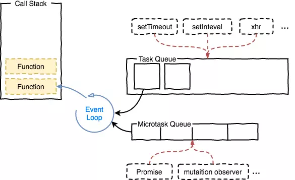
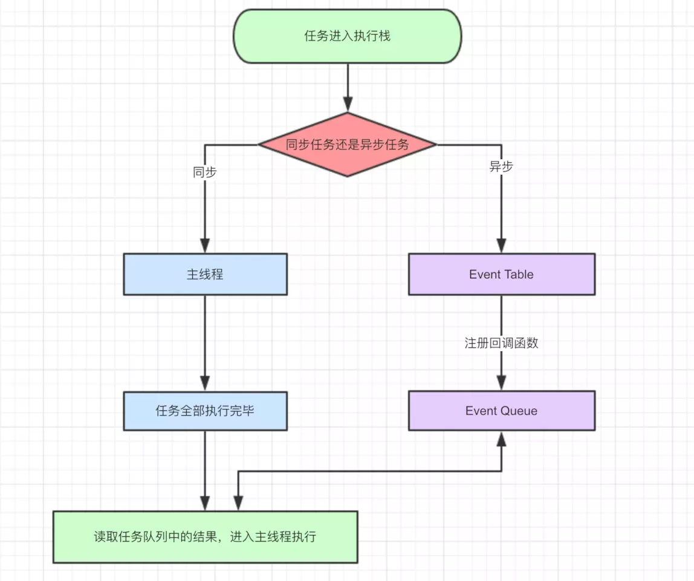
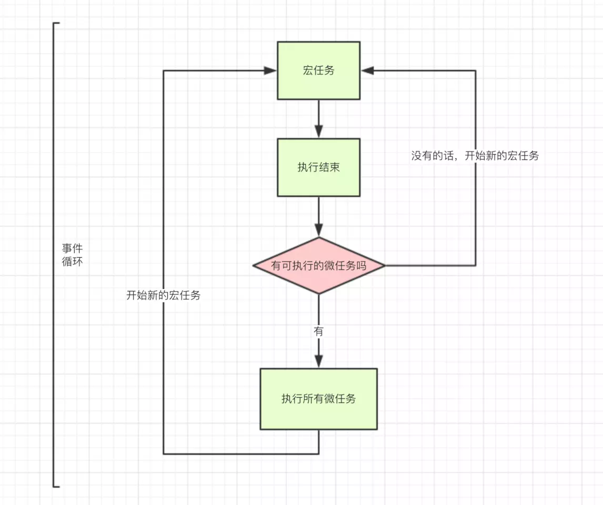

 ### 事件循环
 ##### Event-loop是js的runtime执行机制（不同环境执行方式有所不同：node,浏览器） JavaScript 的一个非常有趣的特性是事件循环模型，与许多其他语言不同，它永不阻塞（例外：如 alert或者同步 XHR）,用来实现异步。处理 I/O 通常通过事件和回调来执行，所以当一个应用正等待IndexedDB查询返回或者一个XHR请求返回时，它仍然可以处理其它事情，如用户输入。

  

- 栈（stack） : 函数调用会形成了一个栈帧,帧中包含函数的参数和局部变量，调用下一个函数时，第二帧就会创建压在第一帧上，当最上面的函数返回时，这一帧就被弹出栈，全部返回栈为空。
- 堆（heap）:对象被分配在一个堆中，一个用以表示一个内存中大的未被组织的区域。
- 队列（queue）：一个JavaScript运行时包含了一个待处理的消息队列。事件注册的回调函数
###### 每一个消息都与一个函数相关联。当栈为空时，则从队列中取出一个消息进行处理。这个处理过程包含了调用与这个消息相关联的函数（以及因而创建了一个初始堆栈帧）。当栈再次为空的时候，也就意味着该消息处理结束。

  

<pre>
  macro-task(宏任务)：包括整体代码script setTimeout setInterval I/O UI交互事件； 
  micro-task(微任务)：Promise process.nextTick MutaionObserver 
  不同类型的任务会进入对应的Event Queue，比如setTimeout和setInterval会进入相同的Event Queue 
  执行顺序：整体代码---所有微任务Queue---第一轮循环结束---宏任务Queue---所有微任务Queue---... 
  node环境Node的Event Loop分阶段，阶段有先后，依次是
   - expired timers and intervals，即到期的setTimeout/setInterval
   - I/O events，包含文件，网络等等
   - immediates，通过setImmediate注册的函数
   - close handlers，close事件的回调，比如TCP连接断开
   同步任务及每个阶段之后都会清空microtask队列
   - 优先清空next tick queue，即通过process.nextTick注册的函数
   - 再清空other queue，常见的如Promise
   而和规范的区别，在于node会清空当前所处阶段的队列，即执行所有task
</pre>

    

[代码](http://jsrun.net/zqgKp/edit)

异步函数A(args..., callbackFn)  A：发起函数(注册函数)发起异步过程  callbackFn：回调函数 处理结果
- setTimeout
调用 setTimeout 函数在指定时间之后在队列中添加一个消息/回调函数/任务。这个时间段作为函数的第二个参数被传入。如果队列中没有其它消息，消息会被马上处理。但是，如果有其它消息，setTimeout消息必须等待其它消息处理完。因此第二个参数仅仅表示最少的时间 而非确切的时间
- setInterval
每隔指定的时间将任务添加到队列中，至于什么时候执行取决于队列中之前的任务是否处理完成
- Promise与process.nextTick(callback)
- setImmediate